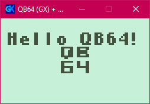

# qb64_nokia_starter

A template for QB64, which main purpose is to provide a quick start on the Nokia 3310 game jam held annually on itch.io.

**Link to Nokia Jam 7**: https://itch.io/jam/nokiajam7

What this template contains:
- Draw string with the classic Nokia font
- Loading an image asset
- Scaled window
- QB64 GX example

The font is from https://phillipp.itch.io/nokiajamresources

You can either use **[QB64](https://qb64.com/)** or the **[Phoenix Edition](https://www.qb64phoenix.com/)** for desktop game development, or **[QBJS](https://qbjs.org/)** for web.

**Nokia 3310 Jam FAQ**: https://itch.io/jam/nokiajam7/topic/4403826/faq

## QB64 Game Engine

`main_gx.bas` is the starter code

This project also has the copy of GX in the boilerplate.

**Optional:** If you want to use the game engine on your own, just copy the `gx` folder from this repo: https://github.com/boxgaming/gx

**About the project:** https://qb64.com/gx.html

**GitHub repo:** https://github.com/boxgaming/gx

## About QBJS

If you plan to use **QBJS**, you can click on the **Share/Export** button, then choose either **Play** or **Auto** as the launch mode. ([Ref](https://qb64phoenix.com/forum/archive/index.php?thread-2095.html))

`main.bas` is meant to be used with the desktop build

`main_qbjs.bas` is the one that you should use instead
